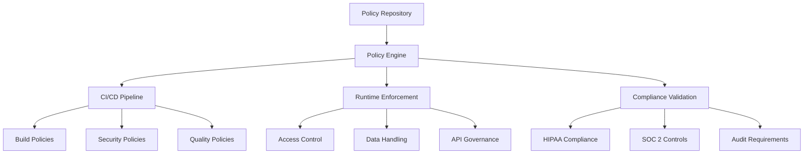

# Policy-as-Code Implementation

## Overview

The HIPAA Compliance Summarizer implements comprehensive Policy-as-Code practices to ensure automated governance, compliance validation, and security enforcement across the entire software development lifecycle.

## Architecture



## Policy Categories

### 1. Security Policies

#### Authentication & Authorization
```yaml
# policies/security/authentication.rego
package security.authentication

# Require MFA for production access
require_mfa {
    input.environment == "production"
    input.user.mfa_enabled == true
}

# Session timeout enforcement
max_session_duration = 3600  # 1 hour

valid_session {
    input.session.duration <= max_session_duration
}

# Role-based access control
allowed_roles := {
    "hipaa_admin": ["read", "write", "admin"],
    "developer": ["read", "write"],
    "auditor": ["read", "audit"],
    "viewer": ["read"]
}

authorize {
    input.user.role in allowed_roles
    input.action in allowed_roles[input.user.role]
}
```

#### Data Protection
```yaml
# policies/security/data_protection.rego
package security.data_protection

# PHI handling restrictions
phi_allowed_environments := {"production", "staging"}

phi_access_valid {
    input.environment in phi_allowed_environments
    input.user.hipaa_certified == true
    input.request.has_business_justification == true
}

# Encryption requirements
encryption_required {
    input.data.classification in ["PHI", "PII", "SENSITIVE"]
}

encryption_valid {
    encryption_required
    input.data.encrypted_at_rest == true
    input.data.encrypted_in_transit == true
}

# Data retention policies
max_retention_days := {
    "PHI": 2555,      # 7 years for HIPAA
    "AUDIT": 2555,    # 7 years for compliance
    "LOGS": 365,      # 1 year for operational logs
    "METRICS": 365    # 1 year for performance data
}

retention_compliant {
    input.data.age_days <= max_retention_days[input.data.type]
}
```

### 2. Development Policies

#### Code Quality
```yaml
# policies/development/code_quality.rego
package development.code_quality

# Test coverage requirements
min_coverage_percent := 80

coverage_adequate {
    input.coverage.percentage >= min_coverage_percent
}

# Security scan requirements
security_scan_passed {
    input.security_scan.critical_vulnerabilities == 0
    input.security_scan.high_vulnerabilities <= 2
}

# Code review requirements
code_review_complete {
    count(input.pull_request.approvals) >= 2
    input.pull_request.security_review == true
    input.pull_request.hipaa_review == true
}

# Dependency security
dependency_scan_passed {
    input.dependency_scan.known_vulnerabilities == 0
    input.dependency_scan.license_violations == 0
}
```

#### Release Management
```yaml
# policies/development/release_management.rego
package development.release_management

# Production deployment gates
production_deployment_allowed {
    input.environment == "production"
    input.tests.unit_passed == true
    input.tests.integration_passed == true
    input.tests.security_passed == true
    input.security_scan.status == "passed"
    input.compliance_check.status == "passed"
    input.change_approval.approved == true
}

# Rollback requirements
rollback_plan_required {
    input.deployment.type == "production"
    input.deployment.rollback_plan != null
    input.deployment.rollback_tested == true
}

# Change management
change_control_required {
    input.change.impact in ["high", "critical"]
    input.change.approval_count >= 2
    input.change.security_review == true
}
```

### 3. HIPAA Compliance Policies

#### PHI Handling
```yaml
# policies/hipaa/phi_handling.rego
package hipaa.phi_handling

# PHI access logging
phi_access_logged {
    input.access.target_data == "PHI"
    input.logging.audit_trail == true
    input.logging.user_id != null
    input.logging.timestamp != null
    input.logging.business_justification != null
}

# Minimum necessary standard
minimum_necessary {
    input.request.data_scope == "minimum_required"
    input.request.business_justification != null
    input.request.time_limited == true
}

# PHI disclosure restrictions
phi_disclosure_allowed {
    input.disclosure.purpose in ["treatment", "payment", "operations"]
    input.disclosure.recipient.verified == true
    input.disclosure.patient_consent == true
}

# De-identification validation
deidentification_complete {
    input.data.direct_identifiers_removed == true
    input.data.quasi_identifiers_assessed == true
    input.data.expert_determination == true
}
```

#### Audit Requirements
```yaml
# policies/hipaa/audit_requirements.rego
package hipaa.audit_requirements

# Required audit events
required_audit_events := {
    "phi_access",
    "phi_modification", 
    "phi_deletion",
    "user_authentication",
    "authorization_failure",
    "system_access",
    "data_export",
    "configuration_change"
}

audit_event_complete {
    input.event.type in required_audit_events
    input.event.user_id != null
    input.event.timestamp != null
    input.event.source_ip != null
    input.event.outcome != null
}

# Audit log integrity
audit_log_integrity {
    input.audit_log.tamper_evident == true
    input.audit_log.encrypted == true
    input.audit_log.backed_up == true
}
```

### 4. Infrastructure Policies

#### Container Security
```yaml
# policies/infrastructure/container_security.rego
package infrastructure.container_security

# Base image requirements
approved_base_images := {
    "python:3.11-slim",
    "python:3.11-alpine",
    "ubuntu:22.04-minimal"
}

base_image_approved {
    input.container.base_image in approved_base_images
}

# Security scanning requirements
container_scan_passed {
    input.container.vulnerability_scan == "passed"
    input.container.malware_scan == "passed"
    input.container.critical_vulnerabilities == 0
}

# Runtime security
runtime_security_enabled {
    input.container.run_as_root == false
    input.container.read_only_filesystem == true
    input.container.capabilities_dropped == ["ALL"]
    input.container.seccomp_profile != "unconfined"
}
```

#### Network Security
```yaml
# policies/infrastructure/network_security.rego
package infrastructure.network_security

# Network segmentation
network_segmentation_valid {
    input.network.phi_network_isolated == true
    input.network.admin_network_separated == true
    input.network.public_access_restricted == true
}

# TLS requirements
tls_configuration_valid {
    input.tls.version >= "1.2"
    input.tls.cipher_suites_secure == true
    input.tls.certificate_valid == true
}

# Firewall rules
firewall_rules_restrictive {
    input.firewall.default_deny == true
    input.firewall.phi_ports_restricted == true
    input.firewall.admin_access_limited == true
}
```

## Policy Enforcement Points

### 1. Pre-commit Hooks
```bash
#!/bin/bash
# .git/hooks/pre-commit

echo "🔍 Running policy validation..."

# Validate against security policies
opa eval -d policies/ -i commit.json "data.security.authentication.require_mfa"

# Check code quality policies
opa eval -d policies/ -i code_metrics.json "data.development.code_quality.coverage_adequate"

# HIPAA compliance check
opa eval -d policies/ -i hipaa_data.json "data.hipaa.phi_handling.phi_access_logged"
```

### 2. CI/CD Pipeline Integration
```yaml
# .github/workflows/policy-validation.yml
name: Policy Validation

on: [push, pull_request]

jobs:
  policy-check:
    runs-on: ubuntu-latest
    steps:
      - uses: actions/checkout@v4
      
      - name: Install OPA
        run: |
          curl -L -o opa https://openpolicyagent.org/downloads/v0.58.0/opa_linux_amd64_static
          chmod +x opa
          sudo mv opa /usr/local/bin
      
      - name: Validate Security Policies
        run: |
          opa test policies/security/
          opa eval -d policies/ -i build_context.json "data.security.authentication.authorize"
      
      - name: Validate HIPAA Compliance
        run: |
          opa eval -d policies/ -i hipaa_context.json "data.hipaa.phi_handling.minimum_necessary"
      
      - name: Validate Infrastructure Policies  
        run: |
          opa eval -d policies/ -i infrastructure.json "data.infrastructure.container_security.runtime_security_enabled"
```

### 3. Runtime Policy Engine
```python
# src/hipaa_compliance_summarizer/policy_engine.py
import json
from typing import Dict, Any, List
import subprocess

class PolicyEngine:
    def __init__(self, policy_path: str = "/policies"):
        self.policy_path = policy_path
    
    def evaluate_policy(self, policy_name: str, input_data: Dict[str, Any]) -> bool:
        """Evaluate a specific policy against input data."""
        try:
            # Convert input to JSON
            input_json = json.dumps(input_data)
            
            # Run OPA evaluation
            result = subprocess.run([
                'opa', 'eval', 
                '-d', self.policy_path,
                '-I', input_json,
                f'data.{policy_name}'
            ], capture_output=True, text=True)
            
            if result.returncode == 0:
                response = json.loads(result.stdout)
                return response.get('result', [{}])[0].get('expressions', [{}])[0].get('value', False)
            
            return False
            
        except Exception as e:
            print(f"Policy evaluation error: {e}")
            return False
    
    def validate_phi_access(self, user_id: str, data_type: str, justification: str) -> bool:
        """Validate PHI access against HIPAA policies."""
        input_data = {
            "access": {
                "user_id": user_id,
                "target_data": data_type,
                "business_justification": justification
            },
            "logging": {
                "audit_trail": True,
                "user_id": user_id,
                "timestamp": "2024-01-15T14:30:00Z",
                "business_justification": justification
            }
        }
        
        return self.evaluate_policy("hipaa.phi_handling.phi_access_logged", input_data)
    
    def validate_deployment(self, environment: str, test_results: Dict[str, Any]) -> bool:
        """Validate deployment against release policies."""
        input_data = {
            "environment": environment,
            "tests": test_results,
            "security_scan": {"status": "passed"},
            "compliance_check": {"status": "passed"},
            "change_approval": {"approved": True}
        }
        
        return self.evaluate_policy("development.release_management.production_deployment_allowed", input_data)
```

## Policy Testing

### Unit Tests for Policies
```yaml
# policies/security/authentication_test.rego
package security.authentication

test_mfa_required_production {
    require_mfa with input as {
        "environment": "production",
        "user": {"mfa_enabled": true}
    }
}

test_mfa_not_required_development {
    not require_mfa with input as {
        "environment": "development", 
        "user": {"mfa_enabled": false}
    }
}

test_session_timeout_enforced {
    not valid_session with input as {
        "session": {"duration": 7200}  # 2 hours
    }
}

test_role_authorization {
    authorize with input as {
        "user": {"role": "developer"},
        "action": "read"
    }
}
```

### Integration Testing
```bash
#!/bin/bash
# scripts/test-policies.sh

echo "🧪 Testing all policies..."

# Run policy unit tests
opa test policies/

# Test policy integration
echo "Testing policy integration scenarios..."

# Scenario 1: PHI access validation
opa eval -d policies/ -i test_data/phi_access_valid.json "data.hipaa.phi_handling.phi_access_logged"

# Scenario 2: Production deployment validation  
opa eval -d policies/ -i test_data/deployment_valid.json "data.development.release_management.production_deployment_allowed"

# Scenario 3: Container security validation
opa eval -d policies/ -i test_data/container_secure.json "data.infrastructure.container_security.runtime_security_enabled"

echo "✅ Policy testing completed"
```

## Monitoring and Compliance

### Policy Violation Alerts
```yaml
# monitoring/policy_violations.yml
groups:
  - name: policy_violations
    rules:
      - alert: UnauthorizedPHIAccess
        expr: policy_violation{type="phi_access"} > 0
        for: 0s
        labels:
          severity: critical
        annotations:
          summary: "Unauthorized PHI access detected"
          description: "Policy violation: {{ $labels.violation_type }}"
      
      - alert: SecurityPolicyViolation
        expr: policy_violation{type="security"} > 0
        for: 1m
        labels:
          severity: high
        annotations:
          summary: "Security policy violation"
          description: "Security policy {{ $labels.policy_name }} violated"
```

### Compliance Reporting
```python
# scripts/generate_compliance_report.py
import json
from datetime import datetime, timedelta
from policy_engine import PolicyEngine

def generate_compliance_report():
    """Generate comprehensive compliance report."""
    engine = PolicyEngine()
    
    report = {
        "timestamp": datetime.now().isoformat(),
        "compliance_status": {},
        "policy_violations": [],
        "recommendations": []
    }
    
    # Check HIPAA compliance
    hipaa_policies = [
        "hipaa.phi_handling.phi_access_logged",
        "hipaa.phi_handling.minimum_necessary", 
        "hipaa.audit_requirements.audit_event_complete"
    ]
    
    for policy in hipaa_policies:
        # Evaluate against recent data
        compliance = engine.evaluate_policy(policy, get_recent_data())
        report["compliance_status"][policy] = compliance
        
        if not compliance:
            report["policy_violations"].append({
                "policy": policy,
                "severity": "high",
                "detected_at": datetime.now().isoformat()
            })
    
    # Generate recommendations
    if report["policy_violations"]:
        report["recommendations"].append("Review and remediate policy violations immediately")
        report["recommendations"].append("Conduct security training for affected personnel")
    
    return report

if __name__ == "__main__":
    report = generate_compliance_report()
    with open("compliance_report.json", "w") as f:
        json.dump(report, f, indent=2)
    print("✅ Compliance report generated")
```

## Best Practices

### 1. Policy Development
- **Version Control**: All policies stored in Git with change tracking
- **Code Review**: Policy changes require peer review
- **Testing**: Comprehensive test coverage for all policies  
- **Documentation**: Clear policy descriptions and rationale

### 2. Enforcement Strategy
- **Fail-Safe**: Default deny for unclear policy decisions
- **Gradual Rollout**: New policies deployed with monitoring
- **Exception Handling**: Clear process for policy exceptions
- **Audit Trail**: All policy decisions logged and tracked

### 3. Compliance Management
- **Regular Review**: Policies reviewed quarterly
- **Stakeholder Input**: Legal and compliance team involvement
- **Automation**: Automated compliance checking and reporting
- **Continuous Improvement**: Policy refinement based on violations

### 4. Emergency Procedures
- **Policy Override**: Emergency access procedures for critical situations
- **Incident Response**: Rapid response to policy violations
- **Recovery Procedures**: Steps to restore compliance after incidents
- **Communication**: Clear escalation and notification procedures

This Policy-as-Code implementation ensures that compliance and security requirements are automatically enforced throughout the development lifecycle while maintaining the flexibility needed for a healthcare application.