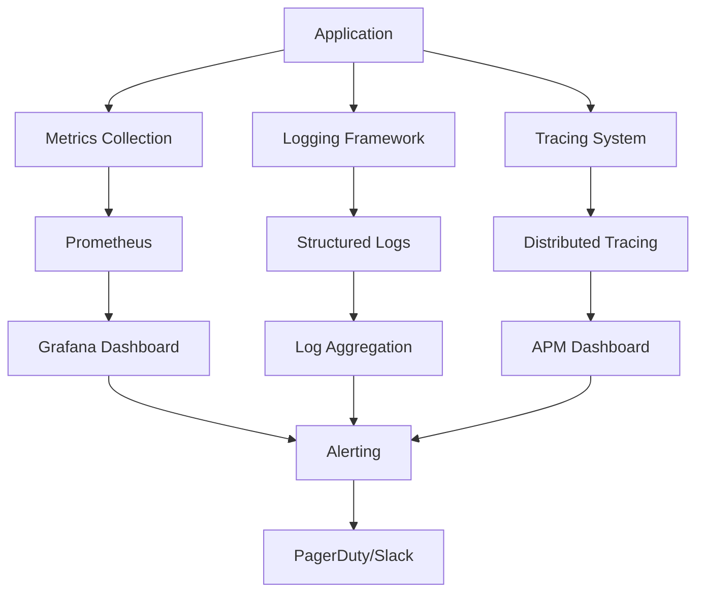

# Advanced Monitoring & Observability

## Overview

The HIPAA Compliance Summarizer includes comprehensive monitoring and observability features designed for healthcare applications requiring high availability, security, and compliance tracking.

## Architecture



## Metrics Collection

### Application Metrics
- **PHI Processing Rate**: Documents processed per minute
- **Redaction Accuracy**: Success rate of PHI detection
- **Compliance Score**: Average compliance rating
- **Processing Latency**: Time to process documents
- **Error Rates**: Failed processing attempts
- **Cache Hit Ratio**: PHI pattern cache effectiveness

### System Metrics
- **CPU Usage**: Application and system load
- **Memory Usage**: RAM consumption and garbage collection
- **Disk I/O**: Document processing throughput
- **Network I/O**: API response times
- **Database Performance**: Query execution times

### Security Metrics
- **Authentication Events**: Login attempts and failures
- **Authorization Violations**: Access control breaches
- **Audit Log Events**: HIPAA compliance tracking
- **Vulnerability Scan Results**: Security posture changes
- **Data Breach Indicators**: Anomalous access patterns

## Logging Framework

### Log Levels
- **DEBUG**: Development debugging information
- **INFO**: Normal application flow
- **WARNING**: Potentially harmful situations
- **ERROR**: Error events that don't stop execution
- **CRITICAL**: Serious errors requiring immediate attention

### Log Categories
- **Application**: General application logs
- **Audit**: HIPAA compliance and audit trail
- **Security**: Authentication, authorization, breaches
- **Performance**: Response times and resource usage
- **PHI**: PHI handling and redaction events (no actual PHI logged)

### Structured Logging Format
```json
{
  "timestamp": "2024-01-15T14:30:00Z",
  "level": "INFO",
  "category": "PHI_PROCESSING",
  "event": "document_processed",
  "document_id": "doc_12345",
  "processing_time_ms": 1250,
  "phi_entities_detected": 15,
  "compliance_score": 0.98,
  "user_id": "user_456",
  "session_id": "session_789",
  "correlation_id": "req_abc123"
}
```

## Distributed Tracing

### Trace Context
Every request includes distributed tracing headers:
- **Trace ID**: Unique identifier for the entire request flow
- **Span ID**: Identifier for individual operations
- **Parent Span ID**: Links child operations to parents
- **Baggage**: Cross-service metadata

### Key Spans
- **Document Upload**: File reception and validation
- **PHI Detection**: Pattern matching and analysis
- **Redaction Process**: Data anonymization
- **Compliance Check**: Validation against HIPAA rules
- **Report Generation**: Summary and audit creation

## Alerting Rules

### Critical Alerts (Immediate Response)
- **Service Down**: Application unavailable > 1 minute
- **High Error Rate**: Error rate > 5% for 5 minutes
- **Security Breach**: Unauthorized PHI access detected
- **Compliance Violation**: HIPAA rule violation identified
- **Data Loss**: Document processing failure > 10%

### Warning Alerts (Monitor Closely)
- **High Latency**: Response time > 2 seconds for 10 minutes
- **Memory Usage**: RAM usage > 85% for 15 minutes
- **Disk Space**: Available space < 20%
- **Cache Miss Rate**: PHI cache hit rate < 80%
- **Dependency Failure**: External service degradation

### Info Alerts (Awareness)
- **Usage Spike**: Processing volume > 150% of normal
- **New Deployment**: Application version change
- **Configuration Change**: Settings modification
- **Scheduled Maintenance**: Planned downtime windows

## Dashboard Specifications

### Executive Dashboard
- **Business Metrics**: Documents processed, compliance scores
- **SLA Tracking**: Availability, performance targets
- **Cost Metrics**: Infrastructure and processing costs
- **Security Overview**: Threat detection summary

### Operations Dashboard  
- **System Health**: CPU, memory, disk, network
- **Application Performance**: Response times, throughput
- **Error Tracking**: Error rates, failure patterns
- **Capacity Planning**: Resource utilization trends

### Security Dashboard
- **Threat Detection**: Security events and patterns
- **Access Control**: Authentication and authorization events
- **Vulnerability Management**: Security scan results
- **Compliance Tracking**: HIPAA audit trail summary

### Developer Dashboard
- **Code Quality**: Test coverage, static analysis
- **Deployment Pipeline**: Build and deployment status  
- **Performance Profiling**: Application hotspots
- **Error Analysis**: Exception tracking and debugging

## Configuration Examples

### Prometheus Configuration
```yaml
global:
  scrape_interval: 15s
  evaluation_interval: 15s

rule_files:
  - "hipaa_rules.yml"
  - "security_rules.yml"

scrape_configs:
  - job_name: 'hipaa-summarizer'
    static_configs:
      - targets: ['localhost:8000']
    metrics_path: '/metrics'
    scrape_interval: 5s
    
  - job_name: 'postgresql'
    static_configs:
      - targets: ['postgres:5432']
```

### Grafana Dashboard JSON
```json
{
  "dashboard": {
    "title": "HIPAA Compliance Summarizer",
    "panels": [
      {
        "title": "PHI Processing Rate",
        "type": "graph",
        "targets": [
          {
            "expr": "rate(phi_documents_processed_total[5m])",
            "legendFormat": "Documents/sec"
          }
        ]
      },
      {
        "title": "Compliance Score",
        "type": "stat",
        "targets": [
          {
            "expr": "avg(compliance_score_current)",
            "legendFormat": "Current Score"
          }
        ]
      }
    ]
  }
}
```

### Alert Rules
```yaml
groups:
  - name: hipaa_critical
    rules:
      - alert: ServiceDown
        expr: up{job="hipaa-summarizer"} == 0
        for: 1m
        labels:
          severity: critical
        annotations:
          summary: "HIPAA Summarizer service is down"
          description: "Service has been down for {{ $value }} seconds"
          
      - alert: HighErrorRate
        expr: rate(http_requests_total{status=~"5.."}[5m]) > 0.05
        for: 5m
        labels:
          severity: critical
        annotations:
          summary: "High error rate detected"
          description: "Error rate is {{ $value | humanizePercentage }}"
          
      - alert: ComplianceViolation
        expr: compliance_violations_total > 0
        for: 0s
        labels:
          severity: critical
        annotations:
          summary: "HIPAA compliance violation detected"
          description: "{{ $value }} compliance violations in the last period"
```

## Integration Points

### APM Integration
- **New Relic**: Application performance monitoring
- **Datadog**: Infrastructure and application monitoring
- **Dynatrace**: Full-stack observability

### Log Management
- **ELK Stack**: Elasticsearch, Logstash, Kibana
- **Splunk**: Enterprise log analysis
- **Fluentd**: Log collection and forwarding

### Incident Management
- **PagerDuty**: Alert escalation and on-call management
- **Opsgenie**: Incident response coordination
- **Slack**: Team notifications and collaboration

## Compliance and Audit

### HIPAA Requirements
- **Audit Logs**: All PHI access logged and retained
- **Access Controls**: Authentication and authorization tracking
- **Data Integrity**: Monitoring for unauthorized changes
- **Availability**: Uptime and recovery time tracking

### Retention Policies
- **Metrics**: 1 year retention for compliance
- **Logs**: 7 years retention per HIPAA requirements
- **Traces**: 30 days for performance analysis
- **Alerts**: Historical data for trend analysis

### Privacy Protection
- **No PHI in Logs**: Strict policy against logging actual PHI
- **Pseudonymization**: Patient identifiers anonymized
- **Access Logging**: All log access tracked and audited
- **Encryption**: All monitoring data encrypted at rest/transit

## Getting Started

1. **Deploy Monitoring Stack**:
   ```bash
   docker-compose --profile monitoring up -d
   ```

2. **Access Dashboards**:
   - Grafana: http://localhost:3000
   - Prometheus: http://localhost:9090
   - AlertManager: http://localhost:9093

3. **Configure Alerts**:
   - Import alert rules from `monitoring/alerts/`
   - Set up notification channels
   - Test alert routing

4. **Validate Setup**:
   ```bash
   make monitoring-test
   ```

## Troubleshooting

### Common Issues
- **Metrics Not Appearing**: Check scrape configuration
- **High Cardinality**: Review metric labels
- **Alert Fatigue**: Tune alert thresholds
- **Storage Issues**: Configure retention policies

### Performance Optimization
- **Metric Sampling**: Reduce collection frequency for high-volume metrics
- **Label Reduction**: Minimize high-cardinality labels
- **Query Optimization**: Use recording rules for complex queries
- **Storage Tiering**: Archive old data to cold storage

For detailed configuration examples and troubleshooting guides, see the monitoring configuration files in this directory.